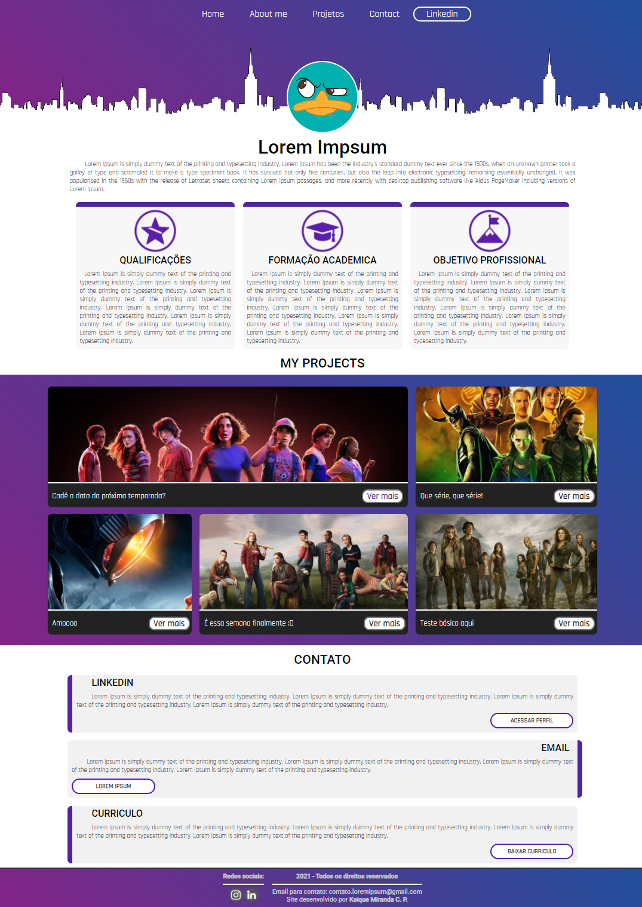
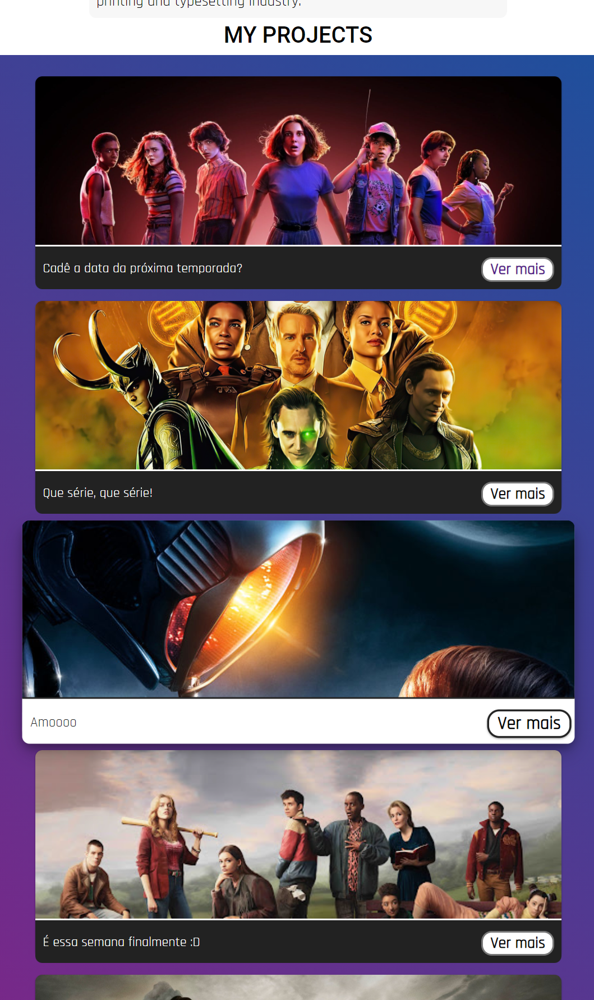
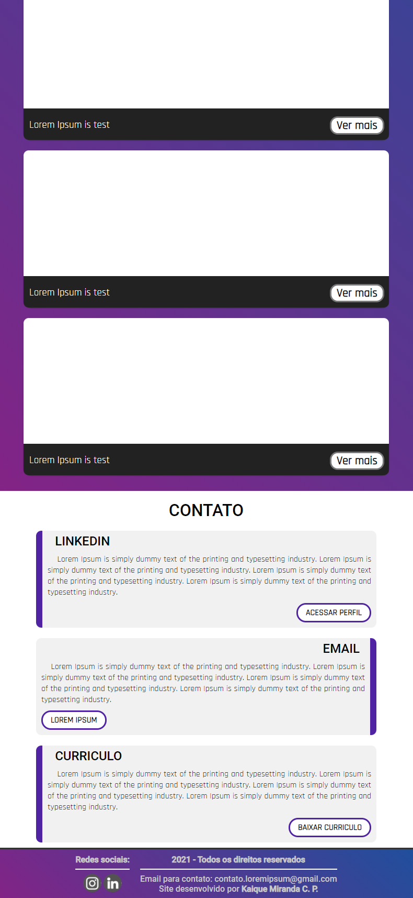

<h2 align="center">
  Aplicação Web para Portifólio
</h2>

<p align="center">
 <a href="#-sobre-o-projeto">Sobre</a> •
 <a href="#-tecnologias">Tecnologias</a> •
 <a href="#-site">Site</a> • 
 <a href="#-responsivo">Responsivo</a> • 
 <a href="#-cards">Cards</a> • 
 <a href="#-como-executar">Executar</a> 
</p>

## 💻 Sobre o projeto

É um site com o objetivo de ser um portifólio. Ele tem apenas uma página principal que é dividida por 3 partes tirando o header e o footer. 
Começando pela parte do about, vai a foto da pessoa, nome e depois cards com informações como qualificações, objetivo profissional e formação. 
Em baixo temos a parte dos meus projetos, aonde são cards que terá as principais informações dos seus projetos com a opção de ver mais. 
E por último, as informações de contato, como email, linkedin e até mesmo a possibilidade de baixar o currículo. 
O site tem uma cara mais clean, com informações de fácil acesso e bem objetivo.

---

## 🛠 Tecnologias

As seguintes ferramentas foram usadas na construção do projeto:

-   **HTML5**
-   **CSS3**
-   **JavaScript**
-   **Firebase**

Não foi usado nenhum framework nesse projeto, o próprio CSS é puro.

## 🚀 Site

<p align="center">
  
</p>

## 🚀 Responsivo

<p align="center">
  
  
  
</p>

## 🚀 Cards

Os cards funcionam a base de javascript com integração ao banco de dados do Firebase, tem também uns efeitos bonitinho no hover:

<p align="center">
   <br><br>
  
</p>

---

## 🛠 COMO EXECUTAR

Basta baixar os arquivos e abrir a index.html, e pronto!
Para configurar os cards, é necessário criar um novo projeto no firebase e colocar a configuração sdk no JS.
```bash

const firebaseConfig = {
  apiKey: " ### ",
  authDomain: " ### ",
  databaseURL: " ### ",
  projectId: " ### ",
  storageBucket: " ### ",
  messagingSenderId: " ### ",
  appId: " ### ",
  measurementId: " ### "
};

```

Após isso, no firebase database:

```bash

#Criar uma coleção: posts
#Adicionar documentos a essa coleção: (cada documento é um post do card)
    - Código do documento você pode setar ou gerar um aleatório.
    - 1º campo: title string VALOR
    - 2º campo: url string VALOR
    - 3º campo: img string VALOR
#Assim que é adicionado um no post, os cards atualizam na hora devido ao snapshot do firebase no JS.

```
